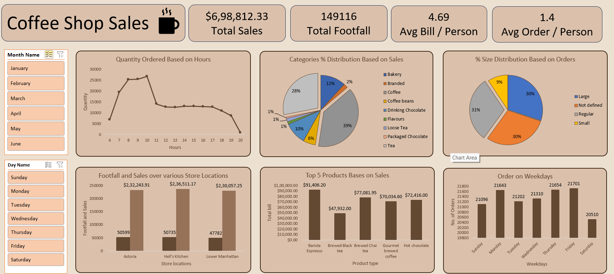

# ☕ Coffee Shop Sales Analysis Dashboard - Excel Project

---

## 📊 Project Overview

This project provides an end-to-end analysis of a coffee shop’s retail sales data using **Microsoft Excel**. The goal is to uncover actionable insights that can help optimize business performance across different locations and time periods.

---

## 📁 Files Included

- `Coffee_Shop_Sales.xlsx` – Main workbook with raw data, pivot tables, charts, and interactive dashboard.
- `Coffee Shop Sales Analysis.pdf` – Brief presentation/report summarizing the key analysis questions and insights.
- `README.md` – Project documentation.

---

## 🎯 Objectives

- Analyze coffee shop sales data for patterns across time, product, and location.
- Identify top-performing products and peak business hours.
- Create a clean, interactive dashboard for business users to explore insights easily.
- Demonstrate business intelligence skills using Excel.

---

## 🛠️ Tools & Features Used

- **Pivot Tables** – Used for summarizing data by product, category, location, and time.
- **Pivot Charts** – Visualized trends and comparisons.
- **Slicers** – Enabled interactive filtering of data.
- **Excel Formulas** – Applied functions like `SUMIFS`, `AVERAGE`, `COUNTIFS`.
- **Conditional Formatting** – Highlighted key figures dynamically.
- **Dashboard Design** – Combined visual elements into a clean reporting interface.

---

## 🔍 Key Business Questions Answered

- How do sales vary by **day of the week** and **hour of the day**?
- Are there any **peak sales times** throughout the day or week?
- What is the **monthly sales revenue**?
- How do sales differ across **store locations**?
- What is the **average order value** per customer?
- Which products are the **top-selling** by revenue and quantity?
- How do sales trends vary by **product category and type**?

---

## 💡 Key Insights

- 🏆 **Best-Selling Product:** Espresso
- 🕒 **Peak Hours:** 7 AM – 10 AM
- 🏪 **Top Performing Location:** Hell's Kitchen
- 📆 **Highest Sales Month:** June
- 💸 **Average Order Value:** $4.69
- 🧾 **Total Revenue Analyzed:** $698,812.33

---

## 📈 Dashboard Preview

---

## 🧠 Skills Demonstrated

- Data Cleaning & Structuring
- Time-Series and Categorical Analysis
- Business Intelligence using Excel
- Visual Dashboard Design
- Decision-Driven Data Interpretation

---

## 🙋‍♂️ Author

**Neelesh Kumar**  
B.Tech, Electronics & Communication Engineering  
Maulana Azad National Institute of Technology, Bhopal

---

## 📫 Contact

📧 Email: [neeleshsingh374@gmail.com](mailto:neeleshsingh374@gmail.com)

---
